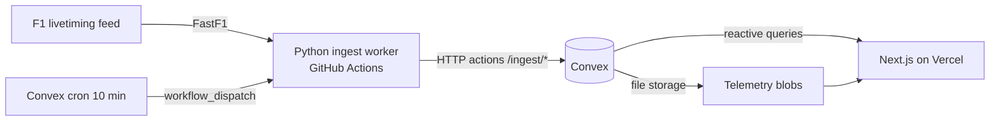

# F1 Telemetry Analysis

A lightweight, modern platform for exploring and comparing Formula 1 car telemetry —
every session from 2018 onwards, distance-aligned lap comparisons, track maps and
automatically detected lap anomalies.

**Stack:** Next.js (Vercel) · Convex (database + file storage) · FastF1 ingestion worker
(GitHub Actions) · uPlot charts. Design language: light-first, Perk-inspired, petrol
accent `#005f73`.

> Unofficial project. Not associated with Formula 1. Data via [FastF1](https://github.com/theOehrly/Fast-F1),
> [Jolpica](https://github.com/jolpica/jolpica-f1) and [OpenF1](https://openf1.org).

## Architecture



- **Metadata** (seasons, events, sessions, drivers, laps, stints) lives in Convex tables.
- **Telemetry** is stored per driver-session as gzip-compressed msgpack with columnar
  little-endian float32 channels (`msgpack+gzip/float32le`).
- A Convex cron dispatches the GitHub Actions workflow for sessions that just ended
  (45-minute buffer), so new data lands shortly after each session.

## Quickstart

```bash
# 1. JS dependencies
npm install

# 2. Link a Convex deployment (interactive — creates/logs into your account)
npx convex dev

# 3. Configure ingestion secrets on the Convex deployment
npx convex env set INGEST_SECRET "$(openssl rand -hex 24)"
npx convex env set GH_REPO "<owner>/<repo>"          # optional: JIT dispatch
npx convex env set GH_DISPATCH_TOKEN "<fine-grained PAT, Actions: write>"  # optional

# 4. Python worker
python3 -m venv .venv && source .venv/bin/activate
pip install -r ingest/requirements.txt
cp ingest/.env.example ingest/.env   # then fill in CONVEX_SITE_URL / INGEST_SECRET

# 5. Smoke test one session
python -m ingest.cli ingest --year 2025 --gp British --session R

# 6. Run the app
npm run dev
```

The Convex deployment URL and HTTP-actions URL are printed by `npx convex dev`
(`https://<deployment>.convex.cloud` and `https://<deployment>.convex.site`).

## Ingestion CLI

| Command | Purpose |
| --- | --- |
| `python -m ingest.cli ingest --year 2025 --gp British --session R` | Ingest one session (idempotent) |
| `python -m ingest.cli by-session --session-key <convex id>` | Ingest the session a workflow was dispatched for |
| `python -m ingest.cli run-due` | Ingest all sessions that are due (used by the 30-min fallback cron) |
| `python -m ingest.cli backfill --from-year 2018 --to-year 2025` | Historical backfill with checkpointing via Convex status checks |

Add `--no-telemetry` to ingest timing data only, or `--dry-run` to preview metadata.

## Repository layout

```
convex/            schema + ingest mutations, HTTP actions, queries, cron
  schema.ts        tables: seasons, events, sessions, drivers, teams, laps,…
  ingest.ts        internal mutations used by the worker (idempotent upserts)
  http.ts          /ingest/* HTTP actions (shared-secret auth)
  sessions.ts      public queries (listEvents, getSession, listLaps,…)
  schedule.ts      due-session detection + GitHub workflow dispatch
  crons.ts         every 10 minutes: dispatch ingestion for finished sessions
ingest/            Python worker (FastF1 → Convex)
  normalize.py     FastF1 objects → Convex payloads + telemetry packing
  convex_client.py HTTP client for the ingest endpoints
  cli.py           ingest / by-session / run-due / backfill
.github/workflows/ ingest-session, ingest-cron
src/               Next.js app (App Router, Tailwind v4, uPlot)
```

## Roadmap

- [x] Project scaffold, design tokens, Convex schema, ingest worker skeleton
- [ ] Full telemetry workbench (distance-aligned charts, delta trace, track map)
- [ ] Season/event/session browser with ingest status
- [ ] Precomputed anomaly scores (unsupervised) + explanations in the UI
- [ ] 1950–2017 metadata import via Jolpica
- [ ] Optional: live data via OpenF1 (MQTT/WebSocket)

## Notes

- Personal, non-commercial project; keep the unofficial disclaimer visible.
- Telemetry is only available from 2018 onwards; a few 2018–2019 events are partial.
- FastF1 enforces conservative rate limits (≈4 req/s soft, 500 req/h hard) and caching is
  enabled by default — backfills take hours and run in chunks.
